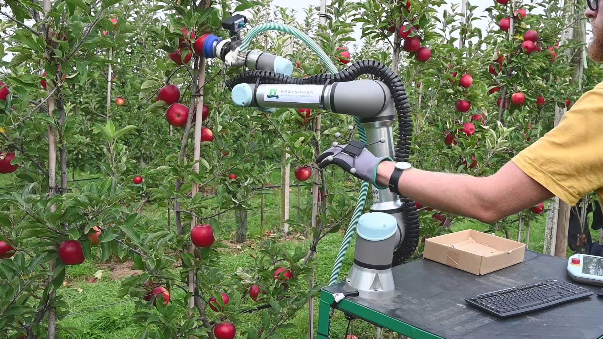

# Evaluating performance and generalizability of Learning from Demonstration for the harvesting of apples & pears

> **Evaluating performance and generalizability of Learning from Demonstration for the harvesting of apples & pears**\
> Robert van de Ven, Ard Nieuwenhuizen, Eldert J. van Henten, and Gert Kootstra\
> DOI: https://doi.org/10.1016/j.atech.2025.101006

## About
Official implementation of the paper *Evaluating performance and generalizability of Learning from Demonstration for the harvesting of apples & pears*. This work is published in *Smart Agricultural Technology*.

## Installation
Describe here how to install your software (if relevant). Which Python version does it require? Which dependencies do you have to install, e.g.:

This software is tested on Python 3.10. To install the dependencies, run:
```
pip3 install -r requirements.txt
```

## Usage
The folder ``code`` contains the scripts used to perform this research. \
The folder ``lfd_executor`` contains the scripts used to execute the demonstrations (``teleop_executor.py``), perform the orchard experiments (``fruit_pick_executor.py``), and the generalizability experiment (``simulation_pick_executor.py``). \
The folder ``includes`` contains the scripts used to process the demonstrations and train the models (``demonstration_processing``),  and to run the generalizability experiment (``generalizability_experiment``). 

## Citation
```
@article{atech2025101006,
title = {Evaluating performance and generalizability of Learning from Demonstration for the harvesting of apples & pears},
journal = {Smart Agricultural Technology},
volume = {11},
pages = {101006},
year = {2025},
issn = {2772-3755},
doi = {https://doi.org/10.1016/j.atech.2025.101006},
url = {https://www.sciencedirect.com/science/article/pii/S2772375525002394},
author = {Robert {van de Ven} and Ard T. Nieuwenhuizen and Eldert J. {van Henten} and Gert Kootstra}
}
```
